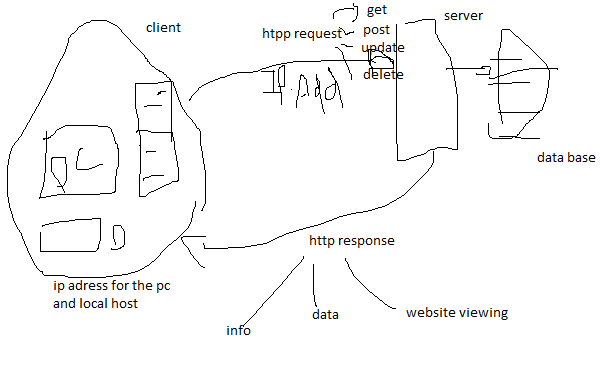

# Movies-Library - v0.6 1/02/2022

**Author Name**: Barham Farraj

## WRRC

## Overview

## Getting Started
<!-- What are the steps that a user must take in order to build this app on their own machine and get it running? -->
- download the repository
- change the directory to "Movies-Library"
- install npm by CMD:  
>npm init -y
- install the packages: 
>npm install express cors 
-install the dotenv package for the v.04 update:
>npm install dotenv
- run the project to start the server: 
>npm start
-install psql so you can have access to your database

-make your own DATABASE on you local machine 
- connect your server to your Database using 
>psql -d "yourdatabase you created" -f schema.sql
-run your server and go to the THUNDER CLIENT EXTENSION/POSTMAN on the web so you can see the post and get method.

## Project Features

### My app includes the following ###
#### 1.Home Page ####
you can access my webwsite by using :
>localhost:3030
#### 2.Favorite Movie Page #### 

you can access the favorite page by using :
>localhost:3030/favorite

### v.04 update 29/01/2022 ###

#### 3.Popular Movies Page ####
you can access it by :
>localhost:3030/popular
#### 4.Search Movies Page ####
you can access it by and  :
>localhost:3030/search

#### 5.Trending Movies Page ####
you can access it by :
>localhost:3030/trending
#### 6.Playing Now Movies Page ####
you can access it by :
>localhost:3030/playing

### v.06 update 1/02/2022 ###
#### 6.Add Movies Page ####
you can access it by :
>localhost:3030/addmovie
you can't add yours yet but we are working on it 
#### 6.get Movies Page ####
you can access it by :
>localhost:3030/getmovies

