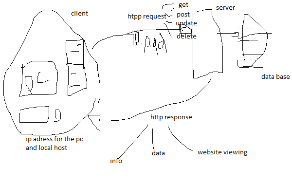

# Movies-Library - v0.2

**Author Name**: Barham Farraj

## WRRC

## Overview

## Getting Started
<!-- What are the steps that a user must take in order to build this app on their own machine and get it running? -->
- download the repository
- change the directory to "Movies-Library"
- install npm by CMD:  
>npm init -y
- install the packages: 
>npm install express cors 
- run the project to start the server: 
>npm start

## Project Features

### My app includes the following ###
#### 1.Home Page ####
you can access my webwsite by using :
>localhost:3000
#### 2.Favorite page #### 

you can access the favorite page by using :
>localhost:3030/favorite